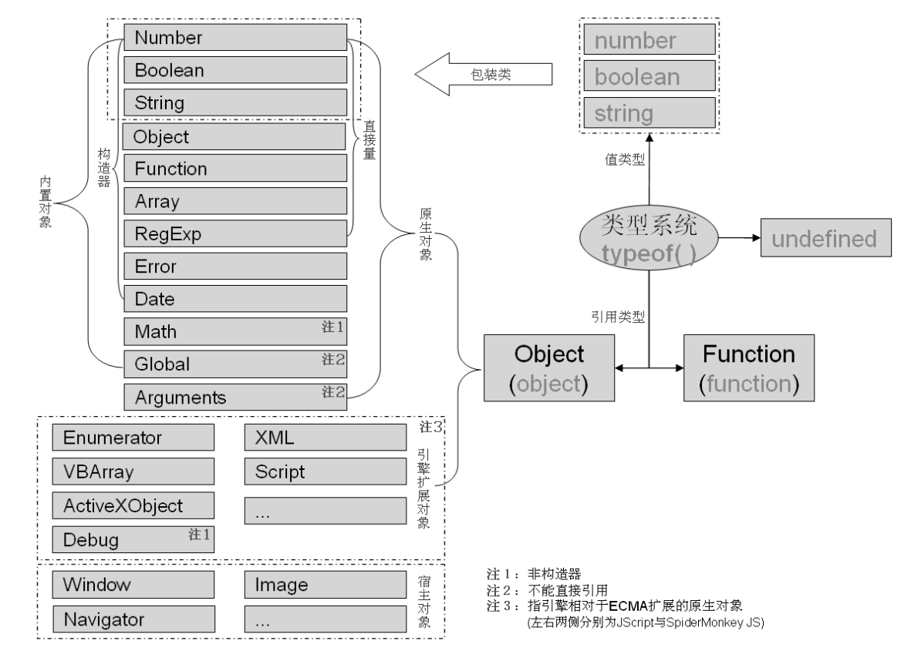

# 类型



### 动态类型转换

```js

+''           // 0
-''           // -0
-+0           // -0
+-0           // -0

1 + ''        // "1"
1 + +''       // 1

1 + '2'       // "12"
1 + +'2'      // 3

12 + '0' - 1  // 119

+'c'          // NaN
1 + 'c'       // "1c"
-'c'          // NaN
1 - 'c'       // NaN
typeof NaN    // "number"

~true         // -2
~false        // -1
~~true        // 1
~~false       // 0
~1            // -2
~0            // -1

010 + '010' // 8010 // 因为这里 0 开始的数字表示八进制数

```

### 七种原始数据类型

##### `null`

##### `undefined`

##### `boolean`

##### `number`

##### `string`

##### `object`

##### `symbol`

```js
null == undefined // true
null === undefined // false
null == 0 // false // 注意这里 null == 0 是 false，在 C 语言里 NULL == 0 是 true
null === 0 // false
true == 1 // true // 这里同 C 语言
true === 1 // false
false == 0 // true // 这里同 C 语言
false === 0 // false
```

### 引用类型（都属于 Object 类型，类比其他 OOP 语言的内置类库）

##### `Boolean`

##### `Number`

##### `String`

##### `Array`

##### `Date`

##### `RegExp`

##### `Function`

##### `Set`

##### `Map`

[更多引用类型](https://developer.mozilla.org/zh-CN/docs/Web/JavaScript/Reference/Global_Objects)

### Reference

https://segmentfault.com/q/1010000007552319